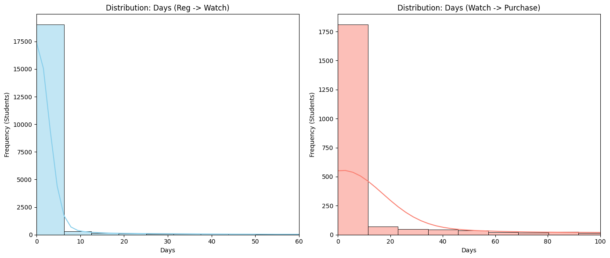

# Student Engagement Analysis (SQL + Python)

## Project Overview
I analyzed the behavior of students on the 365 Data Science platform to understand how they interact with the content and when they are most likely to buy a subscription.

The goal was to answer a simple question: **Is the current marketing strategy timed correctly?** To find out, I looked at the data from three angles:
1.  **Conversion Rate:** How many people who watch a video actually buy?
2.  **Engagement Time:** How long do they wait between registering and watching?
3.  **Purchase Time:** How long do they wait between watching and buying?

## Tools I Used
* **SQL (MySQL):** Used for the heavy lifting—joining tables, cleaning data, and calculating the core metrics.
* **Python (Pandas & Seaborn):** I used this to double-check my SQL findings. SQL gave me the averages, but Python helped me see the *distribution* (the shape) of the data, which ended up changing the entire conclusion.

## The Analysis

### 1. The SQL Part (The "What")
First, I wrote a query to join the student info, engagement, and purchase tables. I calculated the average time differences for everyone.

* **Conversion Rate:** ~11% (This is quite healthy for a freemium model).
* **Average time to watch:** ~3.4 days.
* **Average time to buy:** ~26 days.

At first glance, the 26-day stat suggests that users need about a month of "nurturing" before they buy.

### 2. The Python Part (The "Why")
I wasn't entirely convinced by the "26 days" average. Averages can be skewed by outliers (people who wait a year to buy). So, I exported the raw data to Python to look at the median and mode.

The results were surprising:

*(Note: I generated this graph in the `distribution_analysis.ipynb` notebook)*

* **Registration to Watch:** The mode was **0 days**. Most people register and watch immediately.
* **Watch to Purchase:** The median was **1 day**.

## The Conclusion
The SQL average (26 days) was technically correct, but effectively misleading. It was heavily skewed by a long tail of users who waited months to buy.

In reality, **50% of all purchases happen within 24 hours** of the first video.

This means the "window of opportunity" is much smaller than the average suggests. My recommendation would be to focus marketing efforts (like limited-time discounts) on the **first 48 hours** after a user starts a course, rather than spreading them out over a month.
